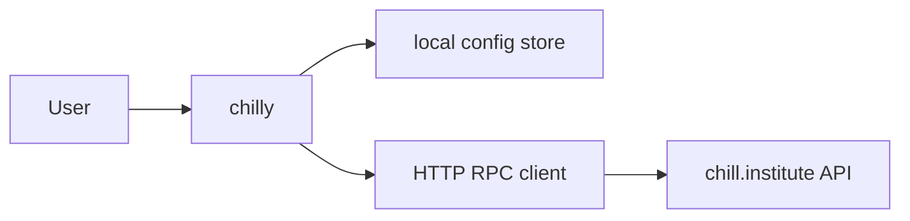
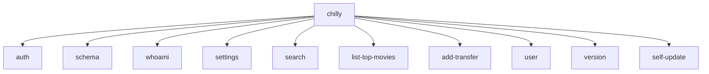
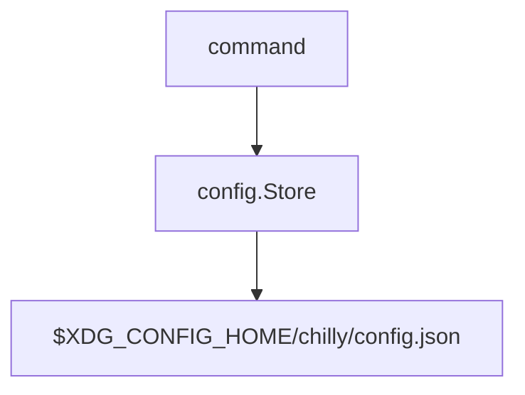
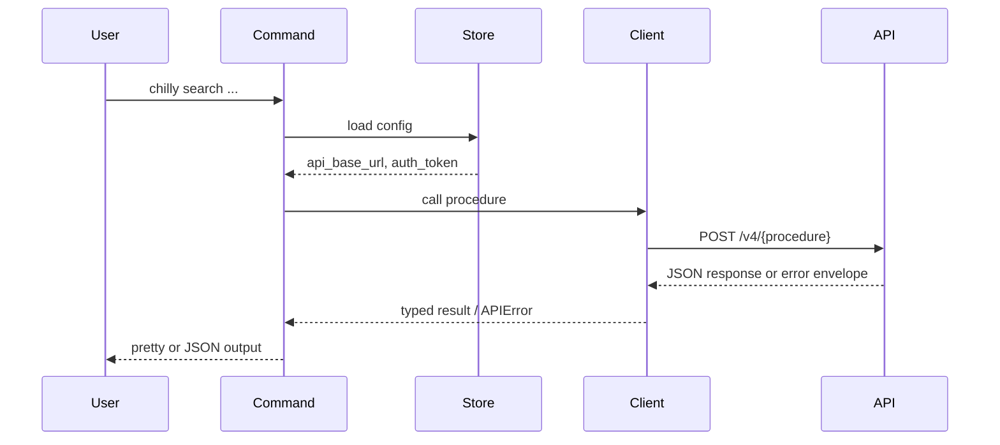
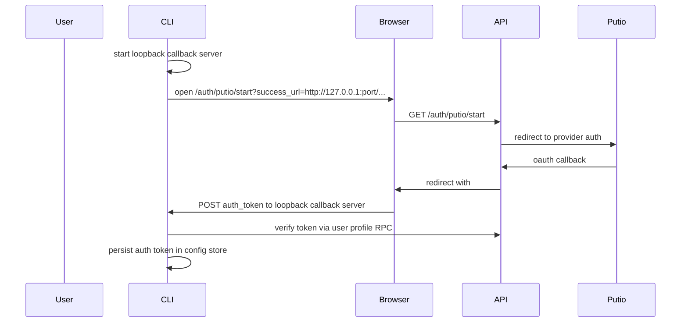

# Architecture

This document describes how `chill-institute/cli` is built.

## System Context

## Components

| Component | Responsibility | Talks to |
|-----------|----------------|----------|
| Cobra command layer | Parse commands, flags, and output mode | app context, config store, RPC client |
| App context | Share config path, API URL, output mode, and helpers | commands, config store |
| Metadata registry | Describe public commands and linked backend procedures for agents | commands, schema surfaces |
| Config store | Persist local auth token and API base URL | filesystem |
| RPC client | Send JSON requests to v4 procedures, attach auth headers, map errors | `chill.institute` API |
| Build info | Carry version, commit, and build date into released binaries | version command, release flow |
| Release updater | Resolve GitHub releases and install matching binaries | self-update command |
| Output renderers | Render pretty or JSON command output | command handlers |

## Command Model

Current command groups:

| Command | Responsibility |
|---------|----------------|
| `auth` | login/logout and token acquisition |
| `schema` | inspect local command and procedure metadata |
| `whoami` | verify current auth state |
| `settings` | inspect and update local CLI config |
| `search` | run search against the hosted API |
| `list-top-movies` | fetch top-movies data |
| `add-transfer` | send transfer requests |
| `user` | user-scoped API operations such as settings reads and writes |
| `version` | expose build metadata and release provenance |
| `self-update` | install a released binary over the current executable |

## Local State

The config store owns:

- API base URL
- auth token

The store normalizes defaults and writes atomically through a temp-file replace flow.
It also keeps the config directory private (`0700`) and the config file private (`0600`).

## Request Flow

## API Client Model

The current client is intentionally lightweight:

- it sends HTTP POST requests directly to `/v4/{procedure}`
- it supports `none` and `user` auth modes
- it adds `X-Request-Id` for tracing
- it parses the shared error envelope into `APIError`

This repo does not yet consume generated RPC bindings directly. It currently uses a manual procedure-oriented client.

## Introspection Model

The CLI keeps a local metadata registry for:

- public command schemas
- backend procedure schemas linked from those commands
- dry-run eligibility for selected mutating surfaces
- field-selection eligibility for selected read surfaces

That registry is the source of truth for:

- `chilly schema`
- `chilly <command> --describe`
- current `--dry-run` support for selected mutating commands
- current `--fields` support for selected read commands

The current milestone does not fetch schema dynamically from the API. Discovery is explicit and local to the CLI repo.

## Package Layout

- `cmd/chilly`: process entrypoint
- `internal/cli`: Cobra adapter layer and command orchestration
- `internal/config`: local config persistence and normalization
- `internal/rpc`: low-level API transport
- `internal/buildinfo`: version metadata injected at build time
- `internal/update`: reusable GitHub release lookup and binary replacement logic
- `scripts/`: shared quality and install helpers used by humans, hooks, and CI

This keeps CLI command glue separate from reusable transport and release modules so future SDK or MCP extraction does not need to unwind command-specific concerns.

## Boundaries

- Local config is the only persistent state in this repo.
- The CLI does not embed backend behavior. It delegates to the hosted API.
- Auth is bearer-token based for user-scoped commands.

## Output And Error Contract

- Successful command data is written to `stdout`.
- Prompts, warnings, and error output are written to `stderr`.
- In `--output json`, failures emit a single JSON error envelope to `stderr`.
- Exit codes are classified into usage (`2`), auth (`3`), API (`4`), and internal (`5`) failures.

For supported mutating commands, `--dry-run` validates local input and writes a deterministic request preview to `stdout` without loading auth or calling the API.

For supported read commands, `--fields` applies a client-side field mask to the JSON response before rendering it to `stdout`.

## Guardrails And Release Flow

- Local hooks live in `.githooks/`
- Shared quality tasks live in `mise.toml`
- CI runs `mise run verify`
- Tagged releases run GoReleaser, publish GitHub release artifacts, and update the Homebrew tap

## Browser Auth Flow

Interactive login is CLI-native rather than web-app mediated:

The CLI talks directly to the API for both token verification and all user-scoped RPCs. The browser is only used to complete the put.io OAuth step and hand the resulting token back to the local loopback server.
