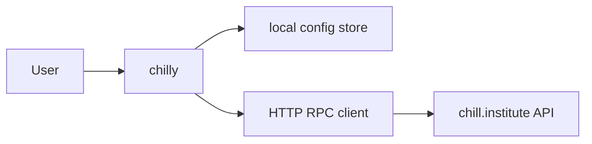
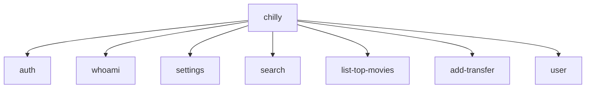
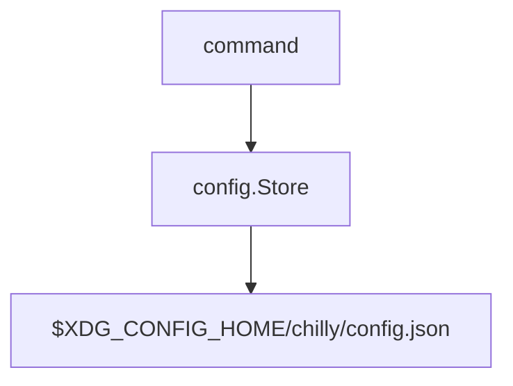
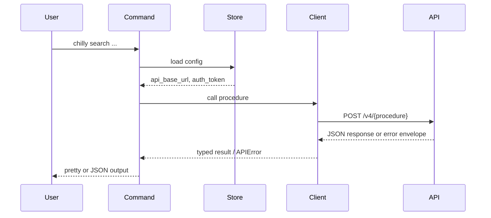

# Architecture

This document describes how `chill-institute/cli` is built.

## System Context

## Components

| Component | Responsibility | Talks to |
|-----------|----------------|----------|
| Cobra command layer | Parse commands, flags, and output mode | app context, config store, RPC client |
| App context | Share config path, API URL, output mode, and helpers | commands, config store |
| Config store | Persist local auth token and API base URL | filesystem |
| RPC client | Send JSON requests to v4 procedures, attach auth headers, map errors | `chill.institute` API |
| Output renderers | Render pretty or JSON command output | command handlers |

## Command Model

Current command groups:

| Command | Responsibility |
|---------|----------------|
| `auth` | login/logout and token acquisition |
| `whoami` | verify current auth state |
| `settings` | inspect and update local CLI config |
| `search` | run search against the hosted API |
| `list-top-movies` | fetch top-movies data |
| `add-transfer` | send transfer requests |
| `user` | user-scoped API operations such as settings reads and writes |

## Local State

The config store owns:

- API base URL
- auth token

The store normalizes defaults and writes atomically through a temp-file replace flow.
It also keeps the config directory private (`0700`) and the config file private (`0600`).

## Request Flow

## API Client Model

The current client is intentionally lightweight:

- it sends HTTP POST requests directly to `/v4/{procedure}`
- it supports `none` and `user` auth modes
- it adds `X-Request-Id` for tracing
- it parses the shared error envelope into `APIError`

This repo does not yet consume generated RPC bindings directly. It currently uses a manual procedure-oriented client.

## Boundaries

- Local config is the only persistent state in this repo.
- The CLI does not embed backend behavior. It delegates to the hosted API.
- Auth is bearer-token based for user-scoped commands.
